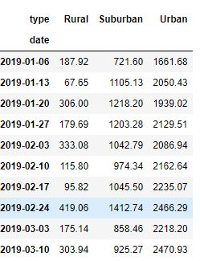

# PyBer_Analysis
## Overview of the analysis: 
In this analysis we used Python skills and Pandas to help the company to make decisions, regarding accessibilty to ride-sharing services. For this we looked at different city types like urban, rural and suburban areas. Our analysis will help further to look at how these differences can be used for decision making.
## Results: 
- Results from *initial analysis* showed that total rides taken were the least in **rural** areas as compared to others. **Urban** cities had higher number of drivers and higher number of rides opted for. However, average per ride in rural area and also average fare per driver were highest in rural areas, as seen in output below. whereas fares for **suburban** cities lied between rural and urban.

- Further when we resampled the data to get total fares for each week, for a date range of 2019-01-01 through 2019-04-28., as seen in image below.

- However, i would like to mention here that prior to carring out this anaysis we had done some research and analysis to look at ride sharing data. Where we found in our results that rural area had fares scattered from middle range to higher range but less number of rides shared with least number of drivers as well,  as seen in scatter plot below.

- Finally, *to come back to our current analysis* , from the resampled data and using OOI interfrace method we were able to plot a graph (as seen below) which showed us total fare by city type and fares for months from Jan to April, 2019.

## Summary:
In short, our analysis clearly showed us differences in fares and also earnings of a driver. We were also able to look for weekly information and also for particular months. Therefore, we were able to conclude that fares were high in rural areas, where the service was low as compared to other areas of the city.

Some recommendations would be:
- New startegies to increase accessibilty in rural areas should be made. Sometimes, increasing fare strategies do not work. Infact, it deters everone using it.
- Drivers should be given some incentives, as an encouragement when servicing in underserved areas.
- Also, sometimes we can make small charge increases or descreases based on how many riders there are in the city during certain months.  